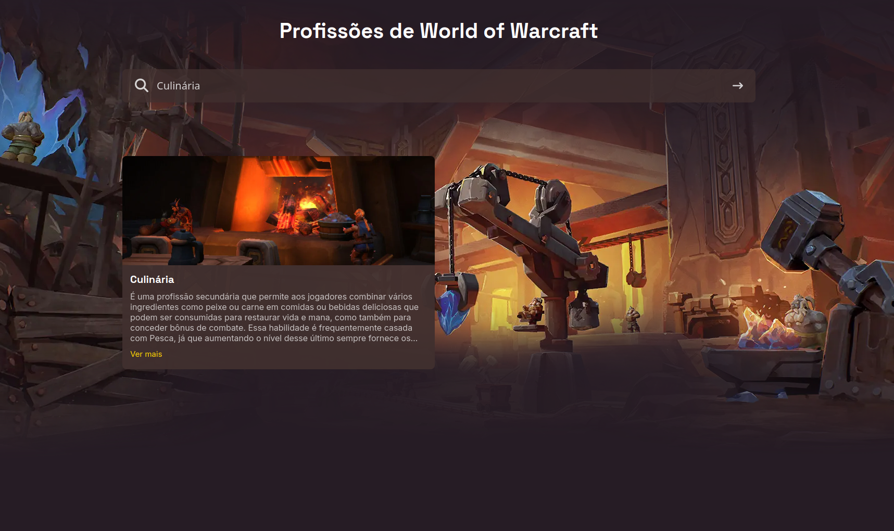

<h1 align="center"> Guia Word of Warcrraft </h1>

Este projeto foi desenvolvido como conclusão da   <strong>Imersão Dev com Google Gemini</strong> da <strong>Alura</strong>.

 
  

  

## Tecnologias

Esse projeto foi desenvolvido com as seguintes tecnologias:

- HTML e CSS
- JavaScript
- Git e Github

## Projeto

Esse projeto simples te permite pesquisar as profissões de world of warcraft. Digite o nome da profissão ou tipo da mesma.

Profissões = Esfolamento, Herborismo, Mineração, Alfaiataria, Couraria, Alquimia ,Ferraria, Joalheria, Encantamento, Escrivania, Engenharia, Culinária, Pesca e Arqueologia.

Tipos = Coleta e Craft.
- [Acesse o projeto finalizado, online](https://jaomilholo.github.io/imersao-dev-alura/)

---

 ## Contato

  
 
   
  
  
Feito por João Milholo.
